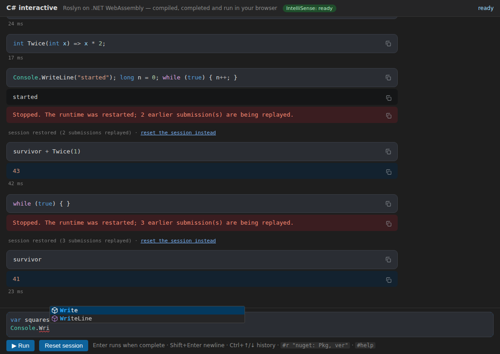
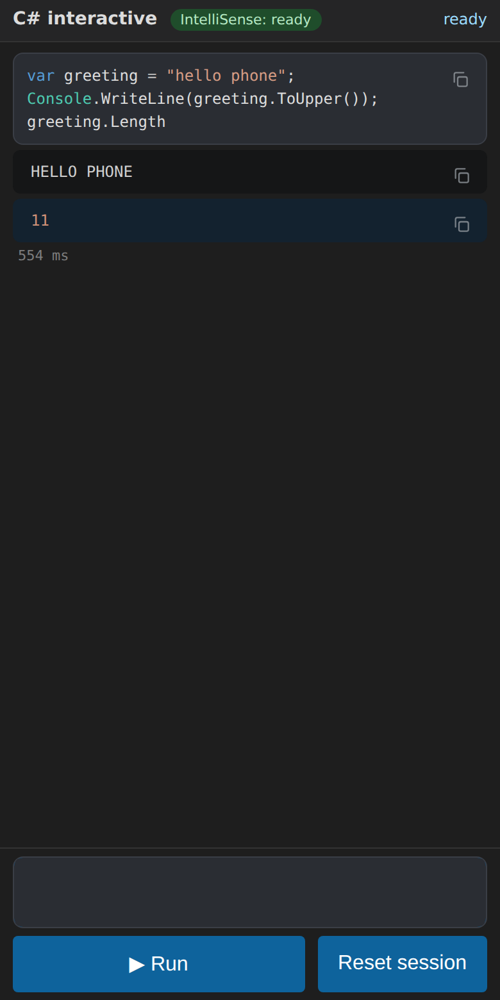

# csharp-wasm

C# interactive (csi/RoslynPad-style REPL) running **entirely in the browser** on .NET 10 WebAssembly. Roslyn compiles each
submission in the page, the result is loaded with `Assembly.Load` and run in the same wasm runtime. No server logic.



## Build, run, publish
```
dotnet test tests/CsRepl.Tests                       # 44 unit tests (completion, classification, resolver, NuGet...; needs network once for the ref-pack NuGet)
node --test "tests/js/*.test.mjs"                    # history, classification, REPL commands, #r completion (fake NuGet API), copy buttons
dotnet run tools/PrepareRefs.cs                      # ref pack -> wwwroot/ref: core.bin (9 assemblies), a/<name>.dll (167, on demand), manifest.json, types.json
dotnet run tools/PrepareLazy.cs                      # Microsoft.CodeAnalysis.Features & deps -> wwwroot/lazy (17 plain assemblies + manifest.json)
dotnet publish src/CsRepl.Wasm -c Release -o dist    # static site in dist/wwwroot (brotli/gzip precompressed)
node tools/serve.mjs dist/wwwroot 8080               # any static server works; this one serves .br/.gz
node tools/stage.mjs dist/wwwroot ../_site/csharp   # what the Pages workflow does after publish (see below); ../_site = the staged site
cd tools/e2e && npm install && node run.mjs ../../../_site ../../docs ../../docs/metrics.json   # headless Chromium e2e + screenshots, served under /webbox/ by tools/pages-sim.mjs (needs internet: Monaco CDN, nuget.org)
```
Needs the .NET 10 SDK (no `wasm-tools` workload: interpreter only). `ref/` and `lazy/` are generated, not committed.

 

## Deployed on GitHub Pages (https://ref12labs.github.io/webbox/csharp/)
`.github/workflows/pages.yml` (webbox root) builds this folder on every push to `main`: `dotnet restore tests/CsRepl.Tests` (fetches the ref pack), `PrepareRefs.cs`, `PrepareLazy.cs`, `dotnet publish`, then `tools/stage.mjs dist/wwwroot _site/csharp`. The source is not copied to the site. `.github/workflows/csharp-ci.yml` runs the .NET and node tests on Ubuntu and Windows.
* **Base path:** every URL in the app is relative to the page (`ref/…`, `lazy/…`, `_framework/…`, imports), so it works under `/webbox/csharp/` as under `/`. The e2e serves the staged site under `/webbox/` and fails on any 404.
* **Compression.** Pages gzips text (html/css/js/json) but cannot send precompressed files with `Content-Encoding`, and whether it compresses `.wasm`/`.dll`/`.bin` is not something to rely on. So the staging step keeps `<file>.br` only for the binaries (177 framework `.wasm`, 17 lazy `.dll`, 167 reference `.dll`, `core.bin`), drops every `.gz` and every `.br` of a text file, and the page fetches the `.br` and decodes it itself (`br.js`: 200 KB WebAssembly decoder, vendored from brotli-dec-wasm, MIT OR Apache-2.0; browsers have no `DecompressionStream('brotli')`). The .NET runtime's own downloads go through `withResourceLoader` the same way. The decoded bytes are kept in the Cache API (warm start: no network, no decoding). If a `.br` is missing or fails to decode, the plain file is fetched instead (`?nobr=1` forces that, for measuring).
* **Measured** (`tools/e2e/measure.mjs`, cold load, Chromium throttled, `tools/pages-sim.mjs` = Pages-like server: prefix, `max-age=600`, gzip on the fly for text only, `.br` as octet-stream). **Not measured on the live Pages URL** (nothing is deployed from this branch); the table is the Pages-shaped simulation. Raw data in `docs/pages-measure.json`.

| Delivery | Transfer to first result | Cable 25 Mbit/s, 20 ms: first result / IntelliSense ready | Mobile 8 Mbit/s, 60 ms |
|---|---|---|---|
| **A: `.br` decoded in the page (shipped)** | **9.9 MB** (13.9 MB with IntelliSense) | **4.9 s / 7.6 s** | **12.9 s / 18.6 s** |
| B: plain files, if Pages gzips wasm/dll | 12.5 MB (17.6 MB) | 5.8 s / 9.0 s | 15.6 s / 22.5 s |
| C: plain files, Pages sends wasm/dll uncompressed | 33.0 MB (46.8 MB) | 12.7 s / 18.8 s | 37.1 s / 53.1 s |

  Decoding all 32 MB of framework files takes ~0.2 s (wasm brotli) vs ~0.1 s (native gunzip); brotli's 22 % smaller payload pays for that on any link under ~100 Mbit/s, and it is independent of what Pages does with binaries.
* **Cache busting** (Pages sends `Cache-Control: max-age=600`): app files get content-hashed names (`main.7f86cce51e.js`, references rewritten, `index.html` is the only unhashed one), `dotnet.js` and all data files are requested with `?h=<content hash>` (the hashes are in `ref/manifest.json` and `lazy/manifest.json`, which are themselves requested with a hash that is baked into `main.js`), the .NET framework files are fingerprinted by the SDK, and the framework Cache API entry is named after a build id. A deploy that changes one file re-downloads that file only.
* **Roslyn persistent storage** is switched off by leaving `DefaultPersistentStorageConfiguration` out of the MEF composition (`IntelliService.HostPartTypes`): its static constructor calls `Process.GetCurrentProcess()`, which throws `PlatformNotSupportedException` in the browser (it used to show up as an unhandled exception in the console). The e2e now fails if the console shows one.

## Commands and directives
Type a command alone on a line (a REPL command is a whole one-line submission; it is never compiled):

| | |
|---|---|
| `#help` | lists the commands, directives and keys |
| `#clear` or `clear` | clears the transcript, **keeps** variables/usings/references and says so (a bare `clear` is the command, so a variable named `clear` must be written `(clear)`) |
| `#reset` | forgets the session state (same as the Reset button) |
| `#load "https://…/x.csx"` | fetches a script and runs it as one submission. **Decision:** a browser has no file system, so only http(s) URLs; the server must allow CORS (raw.githubusercontent.com does); GitHub `blob` and gist page URLs are rewritten to raw; limit 1 MB; `#load` inside a loaded script is a C# error. |
| `#r "nuget: Id, 1.2.3"` / `#r "System.Net.Http"` | C# script directives (handled by `ReplSession`) |

Directives and commands are coloured as preprocessor directives (`#r`/`#help`… grey, the string orange) in the input and in the history, also before IntelliSense is ready (`commands.js`, merged with Roslyn's spans, which blank `#r` lines).
**`#r` completion** (`rcomplete.js`, works before Roslyn is ready): inside the quotes it offers `nuget: ` and the framework assemblies; after `nuget: ` package names from nuget.org's autocomplete service (`azuresearch-usnc.nuget.org/autocomplete`, CORS `*`, re-queried as you type), inserted as `Id, `; after the comma the versions of that package, newest stable first (from `api.nuget.org/v3-flatcontainer/<id>/index.json`, CORS open; type `-` for pre-releases). Failures give an empty list.
**Copy buttons:** output, return-value and error blocks have the same copy icon as the code blocks and copy their plain text. Phone layout unchanged (36 px buttons).

## What the editor does (all computed by Roslyn in the browser)
* **IntelliSense** (`src/CsRepl.Intellisense`, `IntelliService`): an `AdhocWorkspace` (MEF host from Workspaces/Features/CSharp.Features) holds the session as a chain of *submission projects*, each referencing the previous one;
  the text being typed is a scratch submission at the end of the chain. Completion = `CompletionService` (Roslyn filtering data, `InsertionText`; Monaco filters/ranks, commit characters `. ( [ ; ,`),
  plus keyword/statement snippets (`for`, `foreach`, `while`, `if`, `try`, `switch`, `class`, `using`, `cw`; Roslyn's snippet service is VS-only, so these are ours). Hover = `QuickInfoService`.
  Squiggles = compilation diagnostics. **Signature help is not `SignatureHelpService`** (internal to Features): it is built from the semantic model (overload set, active parameter, best-fitting overload preselected).
* **Classification**: `Classifier.GetClassifiedSpansAsync` -> Monaco semantic tokens in the input, and the same spans rendered as HTML in the history (`classify.js`), with Visual Studio dark colours (types teal, methods/locals light, keywords blue, control keywords purple, strings orange, numbers green).
  Before IntelliSense is ready, history shows Monaco's grammar colours; when ready, every past submission is re-classified *in its own context* (`ClassifyCommitted`).
* **History**: Ctrl+Up/Down (`history.js`, unit-tested). The first Ctrl+Up stashes the typed text; Ctrl+Down past the newest entry restores it exactly. Plain Up/Down move the cursor.
* **Look**: no prompt; code blocks (lighter, rounded, copy icon top-right) vs output (dark), return value (blue tint) and error (red tint) blocks; the input box grows with its content; phone layout (screenshot-phone.png).
* **Assemblies on demand**: start with a 9-assembly core (System.Runtime, Console, Linq, Collections, Threading, Threading.Tasks, Memory, Runtime.Extensions, Runtime.InteropServices; 1.2 MB, 270 KB brotli). Others (`ref/a/<name>.dll`, each its own Cache API entry, 167 available) are fetched for
  a `using` namespace, `#r "System.Net.Http"`, a type/namespace name the compiler cannot find (`types.json` index, fetched on first miss), or a CS0012 "assembly not referenced"; the compile is then retried. Loads are listed under the submission (file, size, cache/network).
* **NuGet**: `#r "nuget: Id, Version"` (version optional = latest stable). `NuGetResolver` downloads the .nupkg from `api.nuget.org/v3-flatcontainer` (CORS is open), picks the best `lib/<tfm>` (net10.0 ... netstandard1.0, `runtimes/browser/lib` first), reads the nuspec dependency group for that framework, follows it (skipping packages the framework provides), caches nupkgs in the Cache API, adds the DLLs as references and loads them into the runtime. E2E loads Humanizer.Core and Newtonsoft.Json (latest) for real.
* **Lazy app assemblies**: Microsoft.CodeAnalysis.Features, .CSharp.Features, Workspaces, Elfie, Humanizer, System.Composition.* etc. (14.5 MB raw, 4.2 MB brotli) are *not* in the .NET boot payload. After the first paint `main.js` fetches them (Cache API, 4 in parallel) and hands the bytes to `Interop.AddLazyAssembly`; an `AssemblyLoadContext.Default.Resolving` handler loads them by name, then `StartIntellisense` loads `CsRepl.Intellisense.dll`.
  The Wasm project does not reference it (calls go by reflection through `Bridge`, JSON strings). .NET's built-in lazy loading (`BlazorWebAssemblyLazyLoad`) is Blazor-SDK only, so this hand-rolled variant is used.

## Design
* **Runtime: `Microsoft.NET.Sdk.WebAssembly` app + `[JSExport]`**, not Blazor. We need no component model, router or
  Blazor boot payload; a plain `index.html` + `main.js` calling 5 exported methods is smaller and simpler. Interpreter (no AOT), single thread.
* **`src/CsRepl.Core`** (plain net10.0, unit-testable): `ReplSession`, `ResultFormatter`, `ReferenceStore`.
* **`ReplSession`** drives `CSharpCompilation.CreateScriptCompilation(..., previousScriptCompilation)` itself: emit to a
  `MemoryStream`, `Assembly.Load(bytes)`, find the generated `<Factory>`, invoke it with the submission array, await the `Task<object>`.
  State (variables, methods, types, usings) carries over through the compilation chain + submission array. Console is redirected per submission.
  Exceptions: type + message (+ inner chain); a failed submission does not advance the session.
  *Why not `CSharpScript`:* `Script.GetReferencesForCompilation` always adds `typeof(object).Assembly`, which in the browser has no file
  location ("Can't create a metadata reference to an assembly without location"). Passing `returnType: typeof(object)` also fails (CS0400: it binds by
  System.Private.CoreLib identity, we compile against System.Runtime from the ref pack) - leave `returnType` null (value is still returned).
  A using-only submission emits nothing (Emit fails with no diagnostics); it is kept in the chain without running.
* **Reference assemblies:** loaded assemblies are Webcil, unreadable as metadata. `tools/PrepareRefs.cs` packs the 167 ref-pack DLLs into **one file**,
  `ref/refs.bin` (header: names + lengths, then the bytes; see `ReferenceBundle`), with precompressed `.br`/`.gz`, plus a tiny `manifest.txt` (ref-pack version + size for the progress bar).
  `main.js` fetches it in one request with a percentage, stores it as **one Cache API entry** keyed by the ref-pack version (`csrepl-refs-v2`; older entries are dropped) and passes it to
  `Interop.AddReferenceBundle`. `ReferenceStore` validates each image (PE + assembly metadata). Earlier versions fetched 167 files in parallel, which failed on a slow phone link (HTTP 408/504).
* **Resilience:** `window.fetch` is wrapped so every same-origin startup GET (runtime files too) retries 3 times with backoff on network errors, 408, 429 and 5xx; the status line shows
  "retrying <file> (n/3)" and, if it still fails, the page shows "Could not download <file> ... after 3 tries". The e2e injects 504s on refs.bin and a runtime file to check this.
* **UI:** Monaco 0.52.2 from jsDelivr (falls back to a textarea if the CDN fails) + transcript. Enter runs if `SyntaxFactory.IsCompleteSubmission`, else inserts a newline; Shift+Enter newline; Ctrl+Enter forces; Up/Down history.

## Measurements (GitHub Actions runner, 4 vCPU, headless Chromium, localhost, no throttling; `docs/metrics.json`, `tools/e2e/before.mjs`)
| | before (dd2c3dd) | now |
|---|---|---|
| First load, bytes on the wire to first result (brotli, same origin, no Monaco CDN) | 10.92 MB | **10.09 MB** (framework 9.81 + core refs 0.27) |
| Time to first result (cold) | ~2.73 s | **~2.4 s** (3 runs each: 2.71-2.75 / 2.38-2.44) |
| Time to first result (warm, caches populated) | ~1.7 s | ~2.0 s in the e2e run (reload within the same browser context) |
| IntelliSense: extra download (lazy, after first paint) | n/a | 4.23 MB br (14.5 MB raw), 0.3 s on localhost, 0 on warm start (17/17 from Cache API) |
| IntelliSense ready (cold / warm) | n/a | **~5.0 s / ~3.9 s** after navigation (of which assembly start-up + MEF composition ~1.0 s / 0.8 s) |
| First completion (JIT-cold Roslyn Features) | n/a | ~0.9 s |
| Completion latency, warm (`Console.Wri`, `answer.`, `new List<int>().Ad`, `Enumerable.Ra`) | n/a | 106-354 ms (one run: 136, 218, 350, 141) |
| Diagnostics after typing (cold-ish) | n/a | ~0.8 s first, then similar to completion |
The REPL is usable (first result) ~2.5 s before IntelliSense is ready; typing is not blocked, it just has no IntelliSense yet (status badge in the header). Localhost understates real network time. Numbers vary +-10 % run to run. Interpreter (no AOT): everything Roslyn does runs on the UI thread, so a completion request briefly blocks input.

## What was reused / learned from RoslynPad
Read: github.com/roslynpad/roslynpad (current main, via its CLAUDE.md and layout). Its current design is **desktop-only**: Avalonia + vendored
EditorFeatures + VS-MEF composition (`RoslynHost`), scripts built through `dotnet build` with an MSBuild task and executed in **a separate process** over JSON IPC
(`ExecutionHost`); it has no in-process script compiler anymore. None of that runs in the browser (MSBuild, processes, MEF, file system). What carries over as ideas:
the trailing-expression-is-a-value convention (they rewrite to `.Dump()`; we use the script return value), the `Dump`-style runtime helpers (not ported), and
Roslyn Features as the future source for completion/signature help (not done). **No RoslynPad code is copied.**
Prior art (Try .NET, SharpLab, BlazorRepl, DotNetLab) was *not* read in this session; from general knowledge only: BlazorRepl and DotNetLab also compile in-browser
by shipping reference assemblies as static files, and SharpLab uses a server. Treat that as unverified.

## Limits and next steps
* **RoslynPad: no code was copied.** The approach (an `AdhocWorkspace` over Roslyn Features/Workspaces, submission projects chained for the REPL) is the one RoslynPad.Roslyn and Roslyn's own interactive window use, written fresh here; I did not read or vendor RoslynPad's source this session. (RoslynPad is MIT; vendoring is possible later, e.g. its internal-API wrappers for signature help.)
* Signature help is our own semantic-model implementation (no documentation for parameters, no generic-method type argument help). Completion does not show item descriptions (no `GetDescriptionAsync` yet) and not extension methods/types from namespaces that are not imported.
* After completion the item is inserted as text (`Change` exists in the service but is not used by the editor), so items that need extra edits are plain.
* (Fixed: the Process_PlatformNotSupported console error from Roslyn's persistent storage, see above.)
* Unresolved names only load assemblies when the code is submitted (and `using`/`#r` lines while typing); typing a type from an unloaded assembly without `using` shows an error squiggle until you add the `using`.
* NuGet: simple managed packages only; no native assets, no analyzers/source generators, no `#r "nuget"` version ranges beyond the lower bound, framework-reference packages (e.g. ASP.NET) cannot work. A package needing a runtime assembly the wasm app trimmed or lacks fails at run time with the .NET error.
* A submission that throws is discarded entirely (csi keeps variables assigned before the throw). `#load` takes URLs only; no cancellation of an infinite loop (single thread; would need a worker).
* Compile + run + IntelliSense block the UI thread; moving the runtime to a Web Worker would fix both. The 10 MB framework payload is mostly Roslyn; trimming and AOT are untried.
* Only Linux/Chromium was run here. Monaco comes from a CDN (the page falls back to a plain textarea without IntelliSense).


## Delivery: Cloudflare Worker + GitHub Pages, runtime in Web Workers

- **One build, two staged copies** (`tools/stage.mjs --target=pages|cloudflare`). Paths are relative, so the same files work at `/webbox/csharp/` (Pages) and `/csharp/` (Cloudflare).
  - **cloudflare**: no `.br`/`.gz`, no in-browser decoder; `_headers` (generated into the assets root) sets COOP `same-origin` + COEP `credentialless` on `/csharp/*`, immutable caching for fingerprinted files, no cache for `index.html`/`build.json`, and `Content-Type: application/wasm` for `.wasm`, `ref/*.bin`, `ref/a/*`, `lazy/*.dll` (Cloudflare compresses wasm/js/json at the edge but not application/octet-stream).
  - **pages**: as before (big binaries as `.br`, decoded in the worker, `config.js` BROTLI=true).
- `wrangler.jsonc` (repo root): Worker `webbox`, assets from `_cf_site`. `.github/workflows/pages.yml` runs `wrangler deploy` after the Pages deploy (skipped when the `CLOUDFLARE_API_TOKEN` secret is missing). Rehearse locally: `tools/stage-cloudflare.sh && wrangler deploy --dry-run`, then `TARGET=cloudflare node tools/e2e/run.mjs ../../../_cf_site ...` (`tools/cf-sim.mjs` serves `_cf_site` with its own `_headers` and edge-style compression).
- **Workers**: `runtime-worker.js` runs a .NET runtime per role: `exec` (compile + run, streamed Console output) and `intelli` (Roslyn IntelliSense, follows the session through `Track`). Protocol: `protocol.js` (ids, `out` events, termination = cancel). **Stop** / Ctrl+C terminate the exec worker, start a new one and replay the successful submissions (offer to reset).
- **Threads (`?threads=1`)**: a `WasmEnableThreads` build is staged under `mt/`. It boots on the main thread with COOP/COEP, but **fails inside a Web Worker** in .NET 10 (`mono_wasm_pthread_on_pthread_attached`: `dispatchEvent` of undefined) and a threaded runtime on the main thread cannot call synchronous exports. The page therefore falls back (after 15 s) to the normal runtime and records `metrics.threadsFailed`. Not recommended to ship yet.
