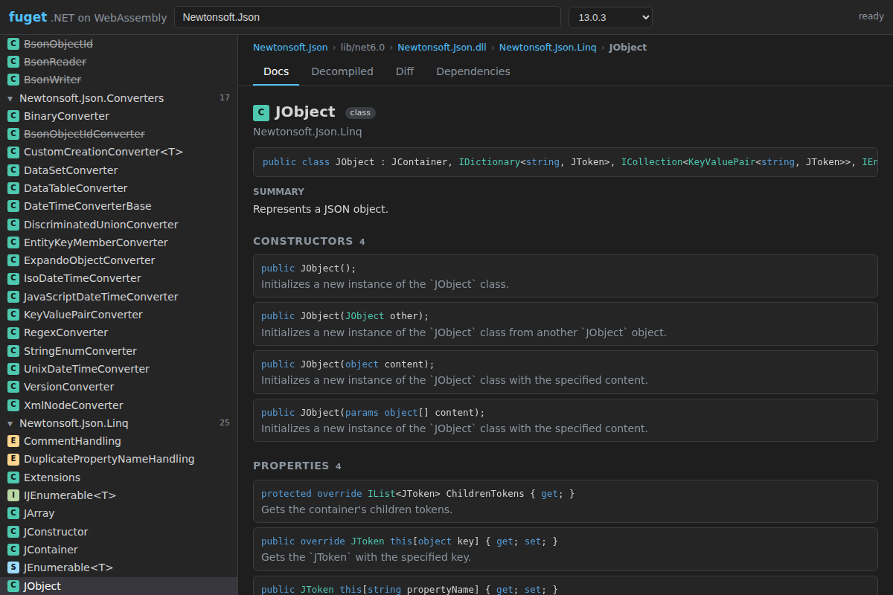
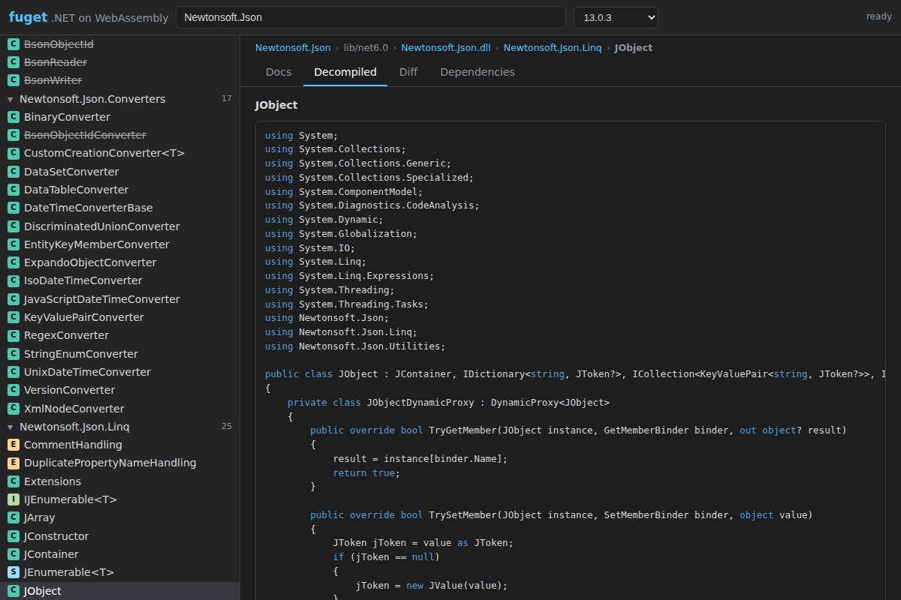
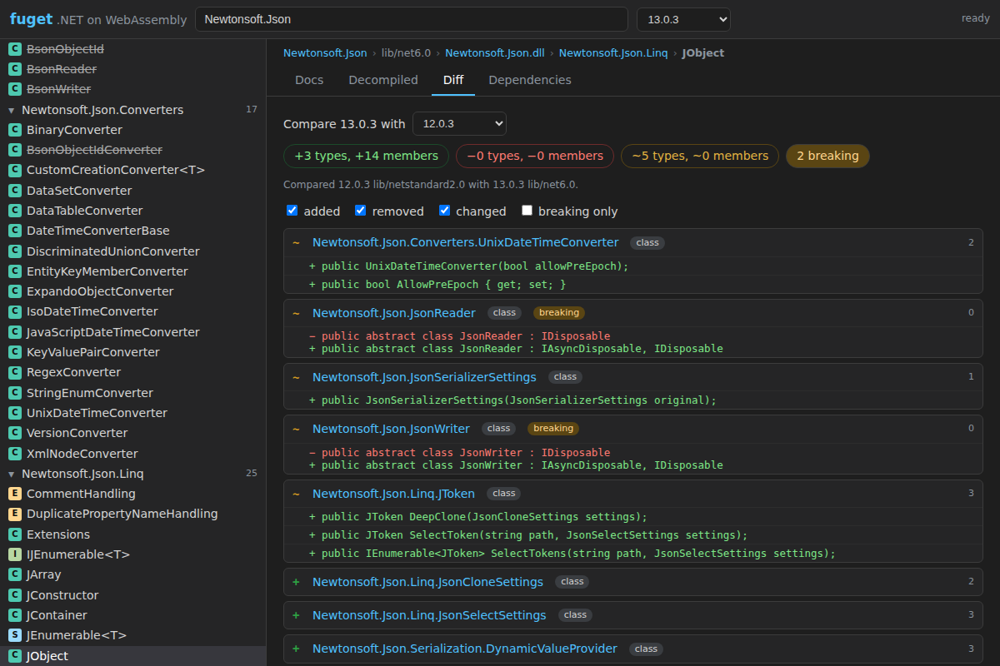
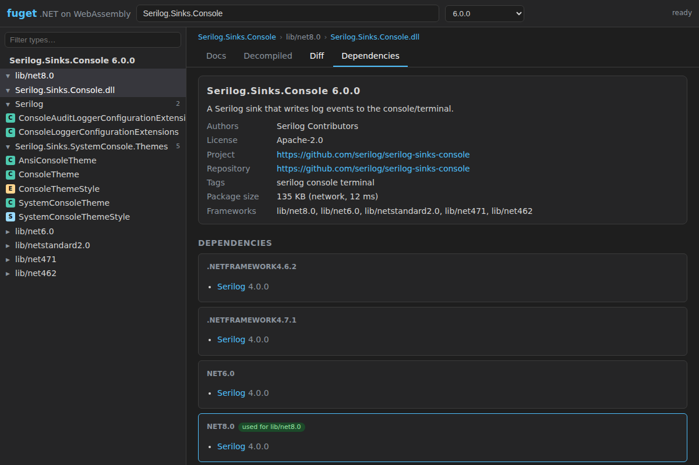
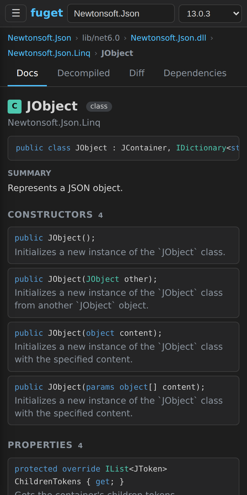

# fuget — a fuget.org-style NuGet package browser on .NET WebAssembly

Pick a package and a version; browse target frameworks, assemblies, namespaces, types and members with XML docs, read the **decompiled C#** (ILSpy's `ICSharpCode.Decompiler`),
see dependencies per framework and **diff the public API between two versions**. Everything is computed in the browser; the only network peers are nuget.org (and the Monaco CDN, optional).
A plain static site: published to `https://ref12labs.github.io/webbox/fuget/`, no server logic.



| Decompiled | Diff | Dependencies | Phone |
|---|---|---|---|
|  |  |  |  |

Deep link example: `#/Newtonsoft.Json/13.0.3/lib/net6.0/Newtonsoft.Json/Newtonsoft.Json.Linq.JObject`
(`#/<id>/<version>/<lib|ref>/<tfm>/<assembly>/<namespace or type>?tab=docs|decompiled|diff|deps&m=<member doc id>&base=<version>`; the URL is kept in sync, a partial link is completed with defaults).

## Build, run, test
```
dotnet test tests/Fuget.Tests                  # 32 tests, offline (Roslyn builds the fixture assemblies/packages); FUGET_NETWORK=1 adds a real Newtonsoft.Json read+decompile
node --test tests/js/*.test.mjs                # deep-link routing
dotnet run tools/PrepareRefs.cs                # reference pack -> src/Fuget.Wasm/wwwroot/ref (167 assemblies, on demand; generated, not committed)
dotnet publish src/Fuget.Wasm -c Release -o dist
node tools/serve.mjs dist/wwwroot 8080         # any static server works (this one serves .br/.gz like Pages-style hosts)
cd tools/e2e && npm install && node run.mjs ../../dist/wwwroot ../../docs ../../docs/metrics.json   # headless Chromium e2e + screenshots (needs internet)
node tools/e2e/subpath.mjs <dir containing webbox/fuget>   # checks it works under /webbox/fuget/
```
Needs the .NET 10 SDK (no wasm-tools workload: interpreter only, like the REPL). The Pages step is in `.github/workflows/pages.yml` (block "fuget"), same idea as the REPL's: build, then publish output replaces the copied sources.
Tests are plain xunit with no OS-specific paths (fixtures are built in memory, reference assemblies come from `TRUSTED_PLATFORM_ASSEMBLIES`); only Linux was run here, Windows not.

## CORS (verified with `curl -H "Origin: https://ref12labs.github.io"`, and in the e2e from a real page)
All return `Access-Control-Allow-Origin: *`: `azuresearch-usnc.nuget.org/query` and `/autocomplete` (search), `api.nuget.org/v3-flatcontainer/<id>/index.json` (versions), `.../<ver>/<id>.<ver>.nupkg` (download), `.nuspec`, `v3/index.json`.

## Design
* **JS** (`wwwroot`): `nuget.js` (search, versions, downloads, caches), `route.js` (deep links, tested), `highlight.js`, `main.js` (tree, tabs, docs, diff, deps UI). Search and autocomplete work before the .NET runtime has booted; the .nupkg of a deep link is prefetched into the Cache API while the runtime starts.
* **`src/Fuget.Core`** (plain net10.0, unit-tested): `Package` (zip, nuspec, lib/ref frameworks, dependency groups), `ApiReader` (System.Reflection.Metadata: public/protected types, members, C# signatures, attributes incl. `[Obsolete]`, XML doc ids), `DocFile` (XML docs flattened to text), `ApiDiff`,
  `Tfm` (compatibility), `DecompilerService` (ICSharpCode.Decompiler + on-demand references), `FugetService` (facade used by the wasm entry points).
* **`src/Fuget.Wasm`**: `Microsoft.NET.Sdk.WebAssembly` app with `[JSExport]` methods returning JSON; bytes come from JS through `[JSImport]` fetch/take (the REPL's trick, since `Task<byte[]>` is not marshalled).
* **Decompiler references.** The decompiler resolves synchronously, so references are fetched first: sibling assemblies in the same lib folder; framework names from the reference pack (`ref/a/<name>.dll`, one Cache API entry each); then the package's own nuspec dependencies (best compatible lib folder, depth 3, ≤40 packages, downloaded from the flat container). Type forwarders (netstandard/mscorlib → System.*) are followed using the assembly's actual type references, so only assemblies that are really used get fetched (JObject: 22 assemblies).
* **Caching.** nupkgs and reference assemblies: Cache API (`fuget-pkgs-v1`, `fuget-refs-<refpack version>`), immutable. Metadata (search, autocomplete, version lists): Cache API `fuget-meta-v1` with a 10 minute TTL. Same-origin runtime files are retried 3× with backoff.
* **Syntax colouring.** Instant regex colouring (signatures, first paint), then Monaco's C# grammar (`monaco.editor.colorize`, CDN, loaded lazily on the first decompile) replaces it. No Roslyn in this app.
* **Diff.** Same lib folder in both versions, else the best compatible framework, matched by doc id; a member is *changed* when its fully-qualified signature or obsolete status differs; removed/changed signatures count as breaking.

## What came from `csharp/` (copied, not shared yet)
* `tools/PrepareRefs.cs` (ref pack → `ref/a/*.dll` + `manifest.json`, with .br/.gz); simplified: no core bundle, no `types.json`; finds the ref pack from the running runtime instead of `DOTNET_ROOT`.
* `tools/serve.mjs` (unchanged), `tools/e2e` structure (Playwright-core, serve + metrics), the project settings of `CsRepl.Wasm.csproj`.
* The `fetchAsset`/`takeAsset` JS interop pattern, the retrying `fetch` wrapper, the Monaco CDN loader, the VS-dark look; `NuGetResolver`'s ideas (flat-container URLs, nuspec groups, min-version of a range, tfm normalisation) rewritten in `Package`/`Tfm`/`PackageStore`.
* Not reused: Roslyn compilation/IntelliSense/ReferenceBundle (not needed here; the REPL's `core.bin` is replaced by exact forwarder following).

## Measurements (GitHub Actions runner, headless Chromium, localhost static server with brotli, no throttling; `docs/metrics.json`)
| | |
|---|---|
| App download, cold (runtime + app; brotli, same origin) | **8.1 MB** (CoreLib 1.2, ICSharpCode.Decompiler 1.0, dotnet.native 1.0, System.Private.Xml 0.85, …); site files 16 KB |
| Package download (Newtonsoft.Json 13.0.3) | 2.4 MB from nuget.org, prefetched in parallel with the runtime boot |
| **Time to first useful view** (deep link on JObject: tree + docs + members), cold | **~2.5 s** (runtime ready 1.1 s, package 1.3 s, assembly read + docs 2.4 s) |
| Same, warm (Cache API populated, new page load) | **~1.9 s** (runtime 0.6 s) |
| Decompile JObject member `Parse` / whole JObject (interpreter) | 0.5 s / 2.1 s (22 reference assemblies loaded) |
| Diff Newtonsoft.Json 12.0.3 → 13.0.3 | 0.5–0.9 s: +3 types, +14 members, ~5 changed types, 2 breaking |
Numbers vary ±10 %; localhost understates real network time (the 2.4 MB package and 8 MB runtime dominate on a phone link). The first view is cheap because the C# interpreter only reads metadata; decompiling larger types is slower, and it blocks the UI thread (single-threaded wasm).

## Limits / next steps
* Decompilation runs on the UI thread (a Web Worker would keep the page responsive for big types); interpreter only, AOT would need the wasm-tools workload. The boot payload is untrimmed (System.Data.Common, Xml… come along): trimming could cut several MB.
* `<inheritdoc/>` is not resolved; docs come from the xml next to the assembly (same folder, else another framework's). Doc text is flattened (lists, code, `see`/`paramref` → inline code).
* Signatures: no generic constraints, `new`/`unsafe`/`required` modifiers, nullable annotations (hidden), tuple element names; attribute enum arguments show as numbers. Only lib/ and ref/ are listed (not runtimes/, build/, tools/).
* Dependencies for decompilation use each range's lower bound (no resolution of floating ranges or conflicts); the diff covers one assembly at a time (the selected one).
* Search uses `azuresearch-usnc.nuget.org` directly (the service index lists several regions; not looked up dynamically). Only Chromium on Linux was run.
