# Our viewer next to Azure DevOps

| Azure DevOps (reference) | PR viewer (e2e screenshots) |
| --- | --- |
| 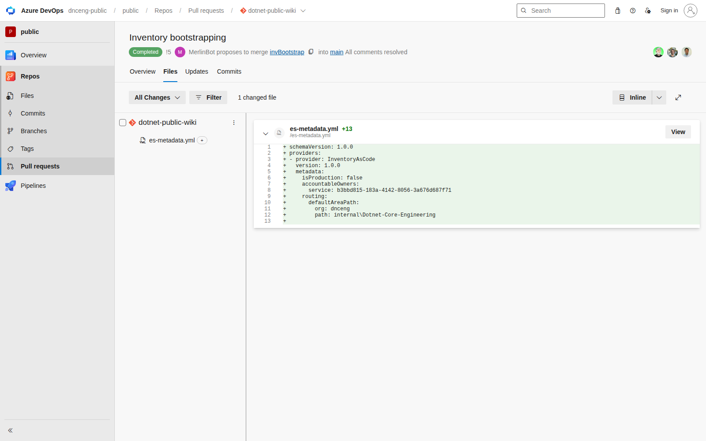 PR Files | 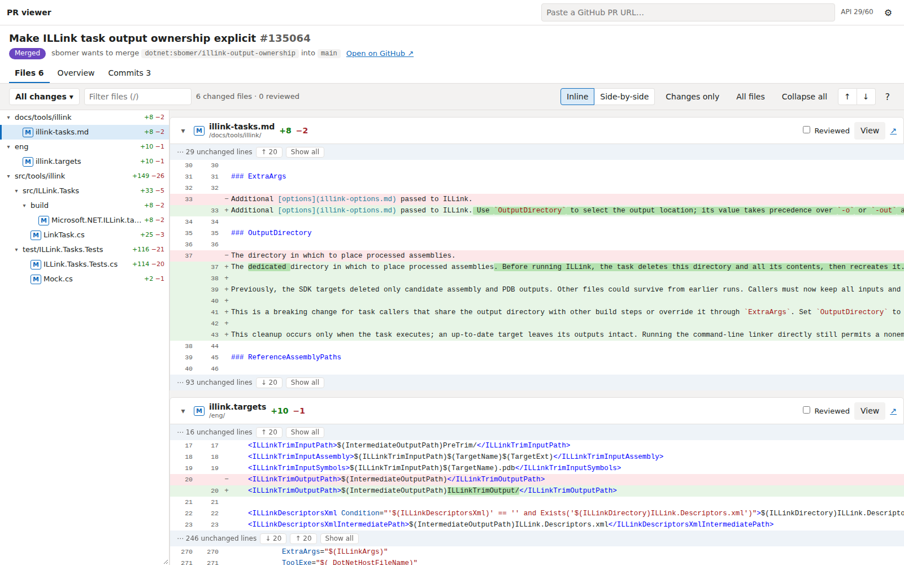 PR with tree, stacked inline diffs |
| 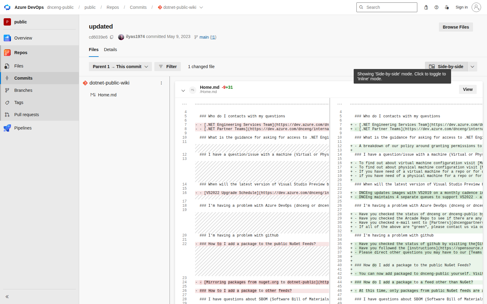 Commit, edited file | 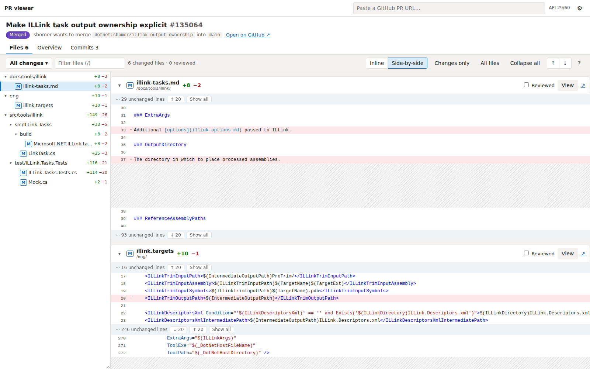 side-by-side with hatched filler |
| 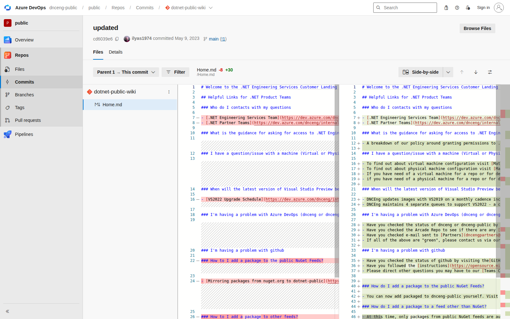 "View": whole file | 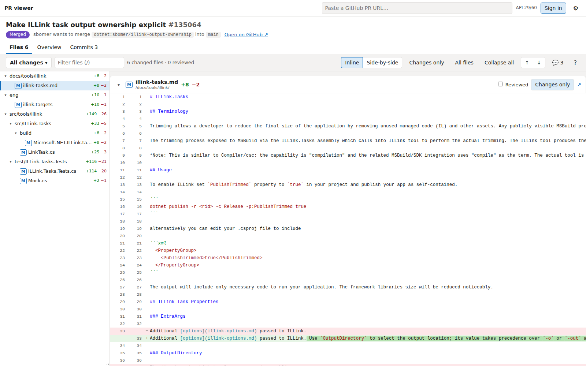 expanded context and full file |
| 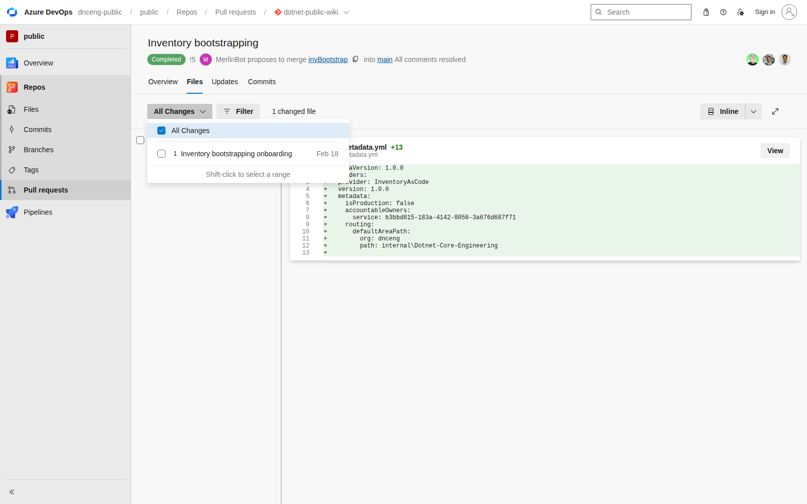 iteration picker | 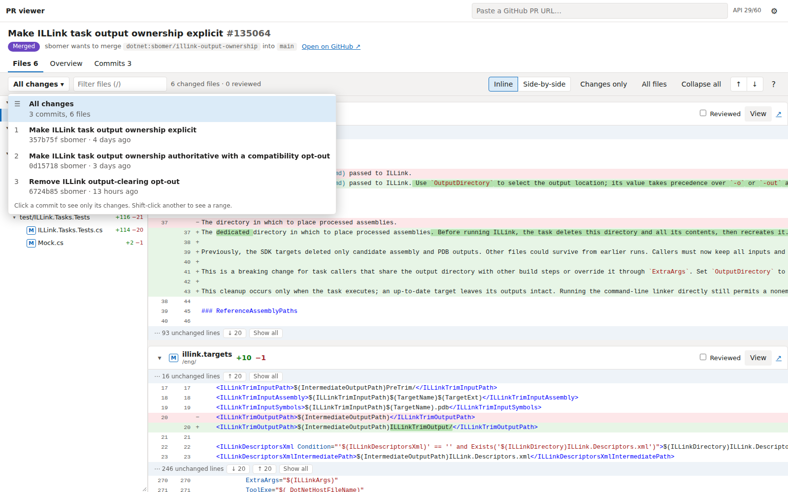 commit picker |
| 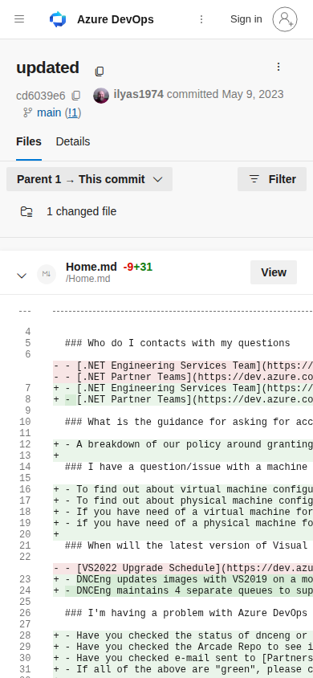 phone | 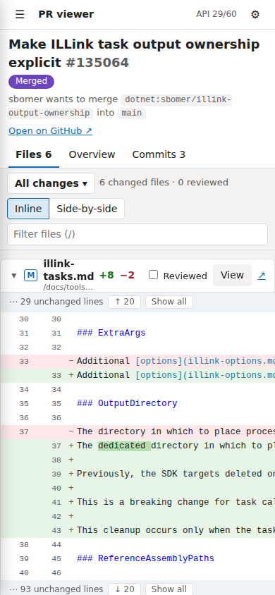 phone, and 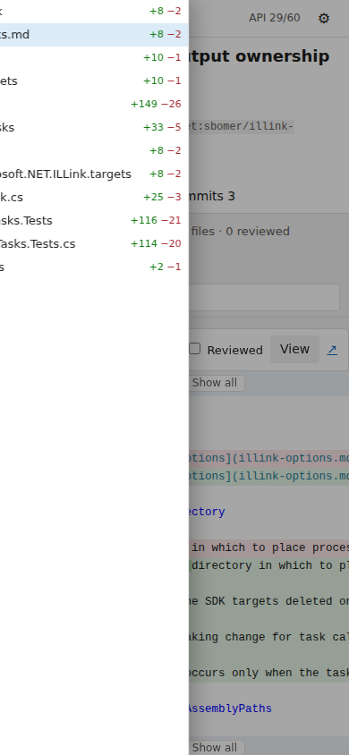 the tree drawer |
| (AzDO inline comments) |  review threads at their lines |
| | 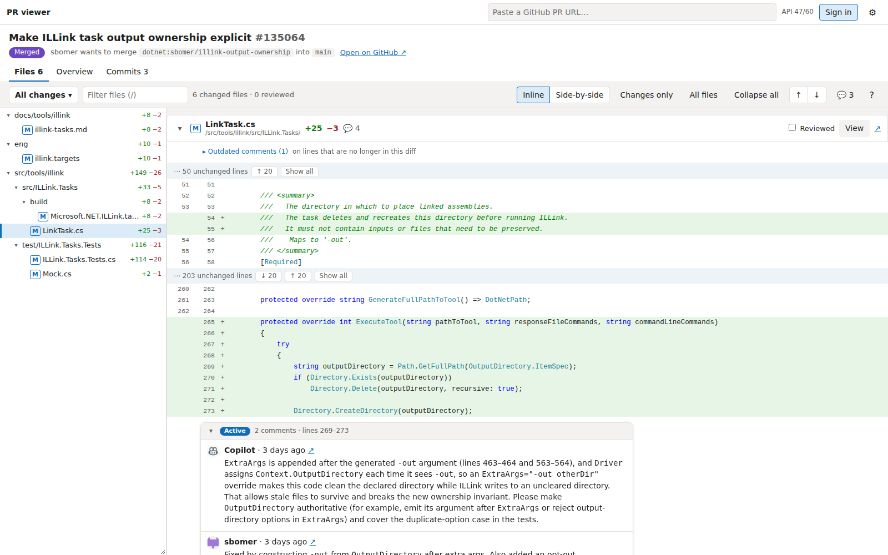 live run against dotnet/runtime#135064 |
