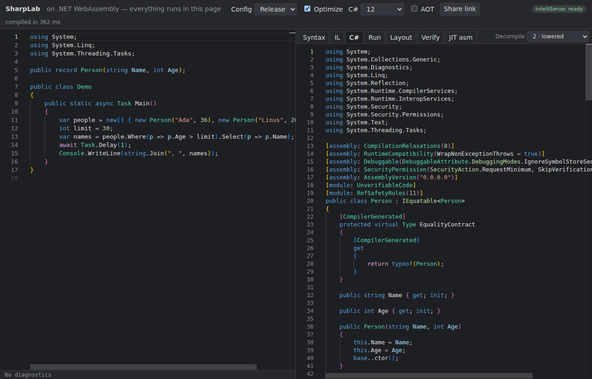
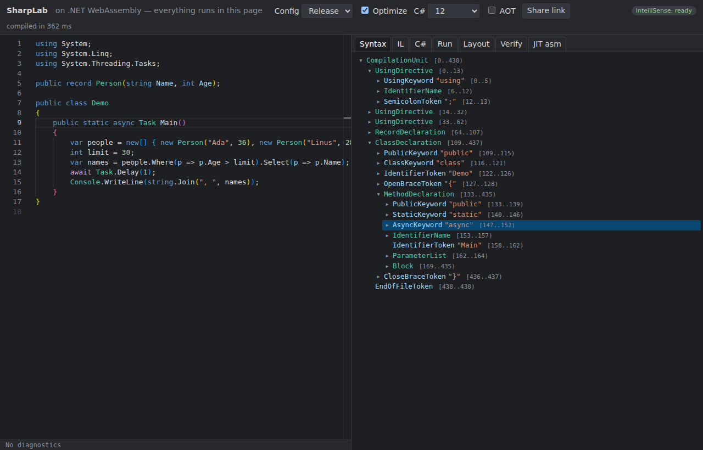

# sharplab

A SharpLab-style C# playground running **entirely in the browser** on .NET 10 WebAssembly (Roslyn compiles in the page; no server logic, plain static files
under `/webbox/sharplab/`). Type C#, see the **syntax tree**, **IL**, **decompiled C# after lowering**, **run output** and **IL verification**; share the code and
options as a link; Debug/Release, language version and optimize toggles. The **JIT asm** tab explains what is possible in a browser and can fetch real JIT output from an endpoint.

 

## Build, test, run
**No .NET workloads** (no `wasm-tools`, nothing machine-wide): the wasm app is a `Microsoft.NET.Sdk.WebAssembly` project, interpreter only, restored from the NuGet packs
(`microsoft.net.sdk.webassembly.pack`, `microsoft.netcore.app.runtime.mono.browser-wasm`, `microsoft.net.illink.tasks`), exactly like `csharp/`.
`dotnet publish` prints a hint recommending wasm-tools; it is only a hint. Nothing here needs native relinking or AOT (see Limits).
```
dotnet test tests/SharpLab.Tests            # 19 tests: compile, options, IL, decompile levels, run, verify, syntax tree (restores the ref-pack NuGet once)
node --test tests/js/*.test.mjs             # 12 tests: share-link codec, syntax-tree <-> editor offsets
dotnet run tools/PrepareRefs.cs             # ref pack -> src/SharpLab.Wasm/wwwroot/ref (core.bin, a/<name>.dll, manifest.json, types.json); generated, not committed
dotnet publish src/SharpLab.Wasm -c Release -o dist
node tools/stage.mjs dist/wwwroot _site/sharplab     # Pages staging: .br for big binaries (decoded in the page), content-hashed app files
cd tools/e2e && npm install && node run.mjs ../../_site ../../docs ../../docs/metrics.json   # headless Chromium e2e, served under /webbox/sharplab/ by tools/pages-sim.mjs
node measure.mjs ../../_site ../../docs/pages-measure.json                                    # throttled cold/warm loads (needs the same npm install)
node tools/serve.mjs dist/wwwroot 8080      # any static server works
(cd jit/endpoint && dotnet build -c Release JitRunner && node --test server.test.mjs)         # the JIT endpoint reference implementation
```
The C# tests use `Path` APIs and no shell; the JS tests use only Node built-ins (`CompressionStream`), so both are meant to run on Windows and Linux. **Only Linux was run here**
(e2e: Chromium on Linux; Monaco comes from the jsDelivr CDN, with a textarea fallback).

## What it does
* **Editor**: Monaco 0.52.2; Roslyn diagnostics from the real compilation (errors, warnings, info) as squiggles and a clickable problem list. The same compilation feeds all views, so what you see is what compiled.
* **Syntax** tab: expandable tree of nodes, tokens and trivia (each with its span), built lazily. **Linked both ways**: click a row to select its span in the editor; move the caret/selection in the editor and the smallest element covering it is expanded and highlighted (`syntaxpath.js`, unit-tested).
* **IL** tab: Roslyn emits the assembly (Debug/Release switch); `ICSharpCode.Decompiler`'s `ReflectionDisassembler` writes ildasm-style text.
* **C#** tab: the compiled assembly decompiled with **ICSharpCode.Decompiler 11.1**, so lowering is visible. A **Decompile** setting selects how high-level: 1 = nearly raw IL (loops, using, foreach... as the IL says), 2 = *lowered* (default: async state machines, closures/display classes, LINQ lambdas, record members are visible), 3 = full ILSpy output (await, query expressions, records). The levels are lists of `DecompilerSettings` switches (`DecompiledView.SettingsFor`).
* **Run** tab: loads the assembly in an `AssemblyLoadContext` and invokes the entry point (`Main`, top-level statements, `async Task Main`) with Console redirected; exceptions and the exit code are shown. Only on pressing Run (never automatically). A library (no entry point) says so. Limits: single thread, so an infinite loop freezes the tab; no stdin.
* **Verify** tab: **ILVerify runs in wasm** (the verifier behind `dotnet-ilverify`, referenced as `lib/ILVerify.dll`, MIT, taken from the `dotnet-ilverify` 10.0.12 tool package because the `ILVerification` library is not published on nuget.org). It resolves references from the loaded ref pack. ~8 ms for the sample. (One trap found on the way: ILVerify compares types by module instance, so the verified assembly and the one its resolver returns must be the same `PEReader`.)
* **Share link**: `#v1:<base64url(deflate-raw(JSON))>` (`share.js`; `CompressionStream`, only non-default options stored; the URL is updated as you type; the *Share link* button copies it). A 17-line program with options is ~200 characters. The format is pinned by a test.
* **Options**: Config Debug/Release (defines `DEBUG`/`RELEASE`/`TRACE`; switching also sets Optimize, which you may then flip separately), **Optimize** (Roslyn `OptimizationLevel`), **C# version** 7.3 to 14, preview, latest; Decompile level (C# tab).
* **JIT asm** tab: see the investigation below.

## Measurements (GitHub Actions runner, 4 vCPU, headless Chromium, `tools/pages-sim.mjs` = path prefix `/webbox`, `max-age=600`, gzip on the fly for text only; `docs/metrics.json`, `docs/pages-measure.json`)
"First useful view" = the editor with the sample compiled and the C# (lowered) view rendered. Monaco comes from a CDN (1.1 MB, not counted). Numbers vary about ±10 %.
| | shipped (.br decoded in page) | plain, Pages gzips wasm/dll | plain, no compression of wasm/dll |
|---|---|---|---|
| Bytes to first view | **11.4 MB** (framework 10.7 + refs 0.5 + decoder/app 0.2) | 14.2 MB | 36.6 MB |
| Cold, localhost, no throttling | **4.3 s** | 4.4 s | |
| Cold, 25 Mbit/s, 20 ms | **7.5 s** | 8.6 s | 16.0 s |
| Cold, 8 Mbit/s, 60 ms (phone) | **16.9 s** | 19.8 s | 43.3 s |
| Warm (Cache API populated), 25 Mbit/s | 2.7 s | 3.0 s | 4.8 s |
Localhost split (cold): editor 0.5 s, .NET runtime started 1.5-1.8 s, references 2.0 s, **first compile + decompile 2.2 s** (cold interpreter running Roslyn), then ~15-40 ms per later compile (Release, sample size; 90-230 ms for a 20-line program with records/async) and 2-440 ms per view (the first decompile is the slow one).
The payload is dominated by the interpreter-run Roslyn/ICSharpCode assemblies (no trimming, no AOT); that is the same 10 MB class as `csharp/`, minus its 4 MB of lazy IntelliSense assemblies (SharpLab fetches the same ones after the first compile, see IntelliSense below), plus ICSharpCode.Decompiler (~1.9 MB) and ILVerify.

## IntelliSense (shared with the C# REPL)
Completion (Roslyn items with kinds, commit characters, keyword snippets; the description is resolved when an item is shown), signature help, hover with docs, semantic colouring (VS Dark; beyond the grammar: types, methods, locals...) and squiggles, from Roslyn's own services running in the page.
* **Architecture** (`runtime-worker.js`, one file, two roles): `exec` = the old runtime (compile, Syntax/IL/C#/Verify, Run) moved off the page; `intelli` = a second .NET runtime of the same app (its files come from the Cache API) that, after the first compile, fetches the lazy assemblies (Roslyn Features/Workspaces, `lazy/`, 17 files, 14.5 MB raw / 4.2 MB brotli, prepared by `tools/PrepareLazy.cs`) and starts `WebBox.Intellisense`. The page only draws; requests are plain strings over the shared protocol (`shared/js/protocol.js`). Typing, completion and hover keep working during a compile or a long Run (e2e: a 5 s busy loop in Run, 92 frames/1.5 s, completion in ~60 ms).
* **Options feed the workspace**: every IntelliSense request carries the options bar; `Interop.Intelli` turns it into `IntelliOptions` (one *regular* document, C# version, Release/Debug = `DEBUG`/`RELEASE` symbols, optimize, exe/dll as the compiler decides, unsafe) and `Bridge.Configure` rebuilds the workspace when they change. So `#if DEBUG` code is inactive in Release (no members offered) and active in Debug; C# 9 flags `namespace N;` with CS8773 as the compile does. The document kind is always *regular* here (that is what the compile builds); *script* is what the REPL uses, and `IntelliOptions` supports both.
* **Squiggles**: IntelliSense diagnostics appear ~250 ms after typing; the full compile (IL, C#, ...) is debounced to 700 ms once IntelliSense is ready (350 ms before) and compiles that were overtaken by newer text are skipped. When the compile has already produced the squiggles for exactly this text and these options, IntelliSense leaves them alone (they include emit-time diagnostics).
* **Cost** (localhost, headless Chromium, no throttling; `docs/intellisense-metrics.json`): first view unchanged (~4.4 s); IntelliSense ready ~7.1 s after navigation (cold), **first completion 1.1 s** after start (REPL, same machine and build: 1.46 s cold); **extra download 4.23 MB brotli (14.5 MB raw) for the lazy assemblies + ~0.1 MB** (same 17 files as the REPL); everything else of the second runtime comes from the Cache API. Memory: a second runtime.
* **Tests**: `shared/tests` (unit: .NET + JS), `tools/e2e/intellisense.mjs` (both host simulations: Pages-like at `/webbox/sharplab/`, Cloudflare-like at `/sharplab/`): `Console.` lists `WriteLine` (real suggest widget) with its description, signature help inside `WriteLine(`, hover on `Console`, semantic spans, Release vs Debug completions inside `#if DEBUG`, C# 9 vs latest squiggle (CS8773), a 5 s Run not blocking frames or completion, and no console errors.

## JIT assembly: investigation (details: `jit/REPORT.md`, `jit/ENDPOINT.md`)
In the browser .NET is the Mono interpreter (or AOT to wasm), so there is no x64 JIT output. Spiked and measured:
* **(a) x86 emulation, real Linux x64 .NET with `DOTNET_JitDisasm`**: **container2wasm (QEMU-in-wasm, amd64) works** and printed correct x64 (`lea eax,[rdi+rsi]; ret`) in headless Chromium, but: download **69 MB (slim rootfs) to 88 MB (stock runtime image) brotli** + 11.5 MB emulator wasm, ~10 s to boot, **~50 s per compile** (a cold `dotnet` start is ~400x slower than native 0.13 s); the emulated CPU is "generic x64", no AVX. **v86** is 32-bit x86 only and .NET has no linux-x86 runtime: not viable. **CheerpX** (Leaning Technologies, commercial; free tier personal/FOSS/evaluation only, no self-hosting or redistribution; Small Business GBP 100/developer/month; Enterprise by quote) runs 32-bit x86 only today: not viable for x64.
* **(b) real machine on demand**: a ~100-line endpoint (`jit/endpoint/server.mjs` + `JitRunner`): POST the compiled assembly, get the `DOTNET_JitDisasm` text. **~0.14 s** per request natively. The reference implementation runs and is tested here (3 tests; the e2e drives the JIT tab against it: 211 ms round trip incl. the browser), but nothing is deployed: it is a design for a hexad sandbox to run (`ENDPOINT.md` has the contract, safety notes and how to start it with `start_process`).
* **Recommendation**: the endpoint is the primary JIT path; emulation is an offline curiosity (~1 min per compile, ~80 MB). The JIT tab states this, lists the options with the numbers above, and has a field for an endpoint URL (stored in `localStorage`; nothing is sent unless you press the button).
* Untried ideas that could change the picture: a long-lived in-VM host that calls `PrepareMethod` instead of restarting `dotnet` (JitRunner is that host, natively; under QEMU it might reach a few seconds per compile); an Alpine/busybox rootfs (smaller download); a 9p mount instead of base64-over-pty.

## What came from where
Copied from `csharp/` (the REPL; copy for now, a shared library can be extracted later):
* `src/SharpLab.Core/ReferenceBundle.cs`, `ReferenceStore.cs` (+ keeps the raw images for the decompiler and verifier), `RefCatalog.cs` (`RefCatalog`, `RefResolver`, `Directives`): reference-assembly bookkeeping and on-demand loading.
* `tools/PrepareRefs.cs` (ref pack -> `core.bin` + on-demand `a/*.dll`), `tools/serve.mjs`, `tools/e2e/` (playwright harness pattern, `measure.mjs`).
* `src/SharpLab.Wasm`: the csproj, the `fetchAsset`/`takeAsset` JS interop, `main.js` pieces (retrying fetch, Cache API asset loader, Monaco loader with textarea fallback).
* From the **csharp-repl** branch (the Pages work in progress, see below): `tools/stage.mjs`, `tools/pages-sim.mjs`, `br.js` and `vendor/brotli_dec_wasm*` (+ licenses), and the `loadBootResource`/`getBytes`/hash code in `main.js`.
New here: everything else (`Compiler`, `SyntaxTreeModel`, `Views` (IL/C#), `Runner`, `Verifier`, `Playground`, the whole UI, `share.js`, `syntaxpath.js`, `jit.js`, the tests, `jit/`). Not reused: the REPL session (`ReplSession`) and the NuGet resolver. IntelliSense is **shared**, not copied: `shared/` (see its README) is built into both apps.

## Pages workflow (coordination with the csharp-repl session)
`.github/workflows/pages.yml` (IntelliSense added one line to the SharpLab step: `dotnet run tools/PrepareLazy.cs`) on this branch is **the csharp-repl branch's version (hexad/s-20261006-030552-6986) plus the SharpLab bits**: a "Build SharpLab" step (restore the ref pack through the test project, `PrepareRefs.cs`, `dotnet publish`; no workloads), `--exclude '/sharplab'` in the rsync, and `node sharplab/tools/stage.mjs sharplab/dist/wwwroot _site/sharplab`. The setup-dotnet/setup-node steps are theirs and shared. Merge note: the workflow also references `csharp/tools/stage.mjs` etc., which exist on their branch, not on this one; after merging both, the file needs no changes. `index.html` and the root `README.md` each got one SharpLab line (a trivial conflict with whatever they add there). Nothing was pushed to webbox main.

## Limits
* No NuGet references (`#r`); references are the .NET 10 ref pack, loaded on demand by `using`/errors.
* Compile, the views and Run run in an `exec` worker, IntelliSense in an `intelli` worker: the page stays responsive, but there is no Stop for a runaway program yet (the exec worker stays busy; the editor, IntelliSense and the other tabs' last results keep working). The first compile after load takes ~2 s while the interpreter warms up.
* The decompile levels are our own grouping of ILSpy settings; level 2 hides records/lambdas/async/LINQ-query sugar but not statement sugar. ICSharpCode.Decompiler targets its own idea of C#; output for exotic constructs can differ from SharpLab's.
* ILVerify against the ref pack (not the implementation assemblies) can only check what the ref assemblies declare; `unsafe` code is reported as unverifiable, as ILVerify does.
* Not trimmed, no AOT, no threads: native relinking/AOT would shrink the payload and speed Roslyn up, but they need the wasm-tools workload's packs; carry on without them until the no-workload AOT setup (another session) lands.
* Run uses non-collectible `AssemblyLoadContext`s on wasm (collectible ones are not supported): each Run leaks its small assembly until reload.
* The syntax tree is capped at 60 000 elements; very large inputs are slow to render.


## Layout tab (ObjectLayoutInspector-style)

The **Layout** tab lists every class/struct declared in the code (generics instantiated with `int`/`string`) with offsets, sizes, padding (and why), object header + method table for classes, nested struct expansion, and a proportional bar. Clicking a field (row or bar segment) or the type name selects it in the editor. It recomputes with each compile; the share link keeps the tab and the measured/modelled choice.

* **Measured** (default): read from the runtime running the page, i.e. Mono wasm32, with `ldflda`/`sizeof` in DynamicMethods (works in the interpreter build; `DynamicCode` is supported but not compiled) and the allocator for class sizes (`LayoutMeasure.cs`). Mono is 32-bit, so pointers are 4 bytes and the object overhead is vtable + sync word.
* **CoreCLR x64 (modelled)**: computed from metadata by `ClrLayout.cs` (sequential/auto/explicit, Pack, Size, reordering of references first then by size, derived-class gap filling). Checked against the real CoreCLR in `tests/SharpLab.Tests/LayoutTests.cs`; Vector128/256 and InlineArray are special-cased but lightly tested.
  * **Known gaps** (model vs real CoreCLR): a random-type comparison (3000 generated classes/structs with nesting, inheritance, explicit layout, Pack, Int128, Decimal, framework structs) now disagrees on 14 types (0.5 %); it was 44 before the base-class placement, Auto-struct alignment and field-name fixes in the comparison harness. The remaining cases are: (1) structs that contain a larger nested custom struct together with references or Int128 (the nested struct's alignment/size in the runtime is not always the one the model predicts); (2) a derived class whose base has `Pack` and automatic layout, where small fields fill the gap in front of an aligned field differently; (3) class instances that end on a 16-byte aligned `Int128` (size rounding). Common types (primitives, references, enums, one level of nested structs, DateTime/Guid/Decimal/Nullable/ValueTuple, ref structs, pointers) match. The view says "modelled" and notes that the framework types' layout is read from the browser runtime.

* Credit: the idea and the table format come from [ObjectLayoutInspector](https://github.com/SergeyTeplyakov/ObjectLayoutInspector) by Sergey Teplyakov (MIT, Copyright (c) Sergey Teplyakov). No code was copied; the library itself needs `Reflection.Emit` details beyond what we rely on, so this is a re-implementation of the approach.
